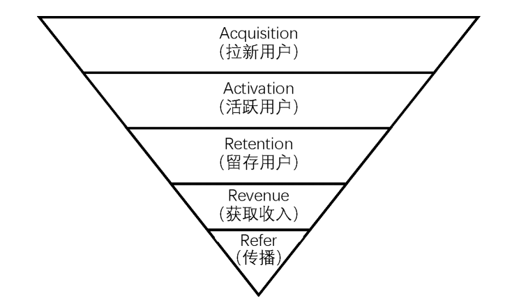

```{r}
#| echo: false

setwd("/Users/simonfair/Desktop/Quarto/new-media-da")

```


# AARRR分析模型 {.unnumbered}



# 拉新指标

是衡量新媒体广告投放效果的重要指标，主要包括CPM（Cost Per Mill）、CPC（Cost Per Click）和CPA（Cost Per Action）。这些指标帮助广告主评估广告投放的效率和效果，从而优化广告策略，提高投资回报率。

## CPM（Cost Per Mill）

指每千次曝光的成本，它是衡量广告投放效率的重要指标，反映了广告主为每千次广告曝光所支付的费用。CPM越低，表示广告投放效率越高，广告主能够以更低的成本获得更多的曝光机会。

### 计算公式：

$$
\text{CPM} = \left( \frac{\text{总花费成本}}{\text{总曝光次数}} \right) \times 1,000
$$

### 计算示例：

假设一个广告活动的总花费成本为5000元，总曝光次数为200000次，那么CPM的计算如下：

$$
\begin{aligned}
\text{CPM} &= \frac{5,000}{200,000} \times 1,000 \\
           &= 0.025 \times 1,000 \\
           &= 25
\end{aligned}
$$

因此，该广告活动的CPM为25元，意味着广告主每获得1000次曝光需要支付25元的费用。

## CPC（Cost Per Click）

指每次点击的成本，是衡量广告投放效果的重要指标，反映了广告主为每次用户点击所支付的费用。CPC越低，表示广告投放效率越高，广告主能够以更低的成本吸引更多的用户点击。

### 计算公式：

$$
\text{CPC} = \left( \frac{\text{总花费成本}}{\text{总点击次数}} \right) 
$$

### 计算示例：

假设你投放了一个网页广告，想吸引人进某个网站，总花费 3,000元，该网页广告总点击次数150次。那么CPC的计算如下：

$$
\begin{aligned}
\text{CPC} &= \frac{3,000}{150}  \\
           &= 20
\end{aligned}
$$

每吸引1个潜在用户点进网站，需要支付20元。

## CPA（Cost Per Action）

指每次行动的成本， 计算逻辑是：总广告花费除以实际达成的行动（转换）次数。是衡量广告投放效果的重要指标，反映了广告主为每次用户完成特定行动所支付的费用。CPA越低，表示广告投放效率越高，广告主能够以更低的成本促使更多的用户完成特定行动。「行动」的定义由你決定，常見的包括：完成報名、购买產品、下载 App、填寫谘询表單等。

### 计算公式：

$$
\text{CPA} = \left( \frac{\text{总花费成本}}{\text{总转化次数}} \right)
$$

### 计算示例：

假设你举办了一場「线上讲座」，並透过广告导流报名： 总广告花费： 10,000 元，总点击数 (CPC 階段)： 500 次， 最终完成报名人数： 20 。

那么CPA的计算如下：

$$
\begin{aligned}
\text{CPA} &= \frac{10,000}{20}  \\
           &= 50
\end{aligned}
$$

每促成1个用户完成报名，需要支付50元的费用。这个CPA值可以帮助你评估广告投放的效果，并决定是否需要调整广告策略以降低CPA，提高转化率。

## 三大指標比較表 (CPM / CPC / CPA)

| 指标 | 英文            | 核心关注点                | 范例                         |
|---------------|---------------|---------------------|-----------------------|
| CPM  | Cost Per Mille  | 品牌曝光 (被看見)         | 花 1,000 元让 10,000 人看到  |
| CPC  | Cost Per Click  | 网站流量 (点進來)         | 花 1,000 元換 100 个人進站。 |
| CPA  | Cost Per Action | 最終转换 (留资料/買東西） | 花 1,000 元換 2 个人下單。   |

::: callout-important
CPA 最重要

-   衡量真正的投资报酬率 (ROI)： 点击再多，如果没人买单也是徒劳。CPA 直接告诉你获取一个客户的代价。

-   预算控制： 如果你知道一个学员的报名费是 3,000 元，而你的 CPA 是 500 元，那你就能清楚算出利润空间。

-   优化转换率 (CVR)： 如果 CPC 很低（很多人进站）但 CPA 很高（没人买），就代表你的网页内容或产品定价出了问题
:::

# 活跃指标

## 日活跃用户数（DAU, Daily Active User)

表示在一天24小时内至少访问过一次网站或应用程序的**不重複用戶（Unique Users）(独立用户)**數量。不管同一個用户在一天內進出網站多少次，DAU 都只會計算為 1。与此对应的，还有**周活跃用户数**(WAU, Weekely Active User)与**月活跃用户数**(MAU, Monthly Active User)。

## 用户黏着度（Stick Rate）

指用户在一定时间内的活跃程度，通常通过DAU（每日活跃用户数）与MAU（月活跃用户数）的比率来衡量。这个指标反映了用户对网站或应用程序的忠诚度和使用频率。用户黏着度越高，表示用户更频繁地使用该平台，说明平台具有较强的吸引力和用户粘性。

$$
\text{用戶黏著度(Stick Rate)} = \left( \frac{\text{DAU}}{\text{MAU}} \right) \times 100\%
$$

### 舉例：

如果某老师开设一门线上课程，有 100 名學生选修 (MAU = 100)。每天固定會上線看進度的學生有 20 名 (DAU = 20)，则黏著度： $20 / 100 = 20\%$。

## PV(Page View)

指页面浏览量，网页被「加载」或「刷新」的总次数。只要页面被读取一次，PV 就会加 1。衡量网站或应用程序的访问量。[***每当用户访问一个页面时，PV就会增加一次***]{.underline}。PV是评估网站流量和用户兴趣的重要指标，通常用于分析网站的受欢迎程度和内容的吸引力。

计算逻辑： 不管是谁看的，只要有开启网页的动作就计算。 同一个使用者反覆刷新页面，PV 会不断累积。

## UV(Unique Visitor)

指独立访客数(唯一页面浏览量)，在同一个工作阶段内，特定网页被浏览的「次数」。它排除了重复浏览，以「人（精确来说是浏览器/Cookie）」为单位。衡量在一定时间内访问网站或应用程序的独立用户数量。[***每个独立用户只会被计算一次，无论他们访问了多少次***]{.underline}。UV是评估网站受众规模和用户覆盖范围的重要指标，通常用于分析网站的用户基础和市场渗透率。

计算逻辑： 同一个使用者在一次访问中，不管看几次同个页面，只算 1 次。能更准确地反映出「有多少人」看过这个内容。

## 比较(PV;UV)

假设有一位学生进入某老师的课程网站，发生了以下行为：

1.进入 `首页 (Home)`

2.点击进入 `课程大纲 (Syllabus)`

3.按「重新整理」刷新 `课程大纲`

4.回到 `首页`

5.再次点进 `课程大纲`

統計結果如下：

| 页面     | PV    | UV    |
|----------|-------|-------|
| 首页     | 2     | 1     |
| 课程大纲 | 3     | 1     |
| **总计** | **5** | **2** |

这两个数字的「差距」能告诉你很多关于网页内容的信息：

-   PV 远高于 UV：

---可能是好现象： 代表内容非常吸引人，使用者反覆回来查看（例如：参考资料、工具页面）。

---也可能是坏现象： 可能代表网页加载有问题、信息太复杂，导致使用者必须不断重新整理或来回跳转才能看清楚。

-   PV 与 UV接近：

---代表使用者通常「看完就走」，没有回头再看的动力。
